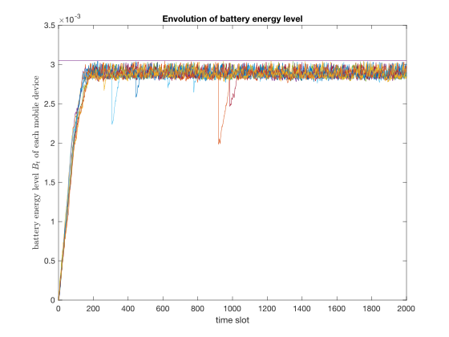
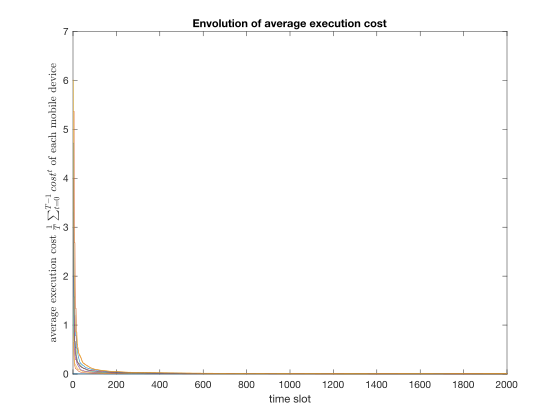
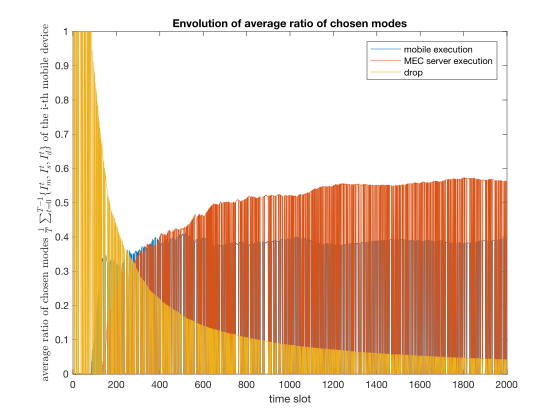
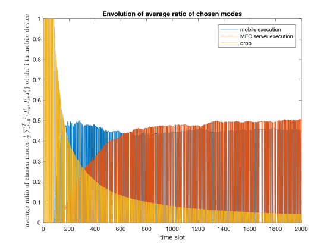
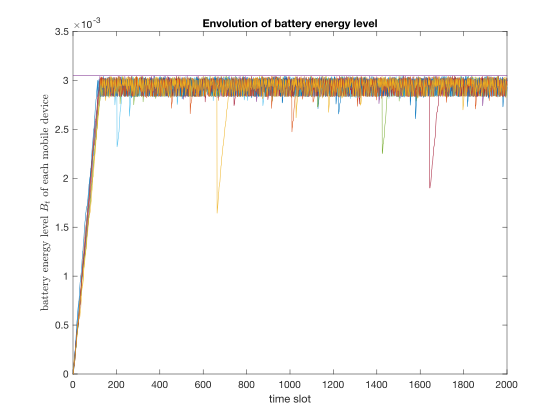
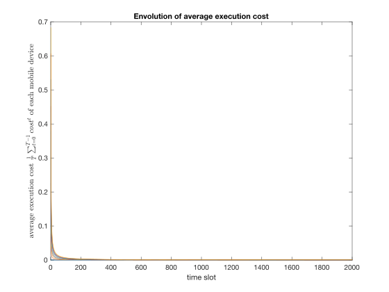

# Edge Computing Codes
- [Edge Computing Codes](#edge-computing-codes)
  - [UIC18](#uic18)
    - [LODCO algorithm](#lodco-algorithm)
    - [LODCO-based Greedy algorithms](#lodco-based-greedy-algorithms)
  - [Dependent-Funciton-Embedding](#dependent-funciton-embedding)
  - [Final Notes](#final-notes)

Edge computing is the practice of processing data near the edge of the network, where the data is being generated, instead of in a centralised data-processing warehouse. This repos provides a better implementation of proposed algorithms in Edge Computing (it may not the same as the original algorithm).

**Announcement**: The original repos: **Implementation_of_MEC_papers** was deprecated.

## UIC18
The folder `UIC18` includes codes for the following paper:

**Hailiang Zhao**, Wei Du, Wei Liu, Tao Lei and Qiwang Lei, *QoE Aware and Cell Capacity Enhanced Computation Offloading for Multi-Server Mobile Edge Computing Systems with Energy Harvesting Devices.* In: **Proceedings of the 15th IEEE International Conference on Ubiquitous Intelligence and Computing (UIC'18)**, Guangzhou, China, 2018.

### LODCO algorithm
This paper is based on **the Lyapunov Optimization-based Dynamic Computation Offloading (LODCO) algorithm**, which was proposed in the following paper:

Y. Mao, J. Zhang and K. B. Letaief, *Dynamic Computation Offloading for Mobile-Edge Computing With Energy Harvesting Devices*. In: **IEEE Journal on Selected Areas in Communications**, vol. 34, no. 12, pp. 3590-3605, Dec. 2016.

We implemented **the LODCO algorithm** (`LODCO.m`), and the simulation results are as follows (50000 time slots).

    

### LODCO-based Greedy algorithms
**LODCO-based Greedy algorithm** was proposed for computation offloading in *multi-user multi-server* Mobile Edge Computing (MEC) systems. We implemented the algorithm (`greedy_LODCO.m`). The simulation results are as follows (2000 time slots, 10 mobile devices and 8 MEC servers).

    

    

**LODCO-based epsilon-Greedy algorithm** was proposed to increase the ratio of MEC server execution (`eps_greedy_LODCO.m`). The ratio comparasion is as follows. In the left figure (above), epsilon is set as 0.3, and in the right one (below), epsilon is 0.8. The ratio of MEC server execution increases as epsilon increases.

**LODCO-based Genetic Algorithm with Greedy Policy** was an alternative way for computation offloading in *multi-user multi-server* MEC systems (`linprog_LODCO.m`). The Genetic Algorithm (GA) procedure can be replaced by MATLAB ToolBox function ``intlinprog(...)``. As a result, we use ``intlinprog(...)`` instead of GA in the latest version. The simulation results are as follows (2000 time slots, 10 mobile devices and 8 MEC servers). 

    

## Dependent-Funciton-Embedding
Dependent function embedding is the combination of function placement and stream mapping on the heterogenous edge. Function placement studies how the dependent functions in an app (abstracted as a DAG) are placed on edge servers to minimize the makespan. Stream mapping studies how the data stream transferred between each function pair are mapped to different links between edge servers.

The detial codes is located at https://github.com/hliangzhao/Dependent-Function-Embedding.

## Final Notes
If you have used the codes in your research works, we would appreciate citation to the paper mentioned before:

**Hailiang Zhao**, Wei Du, Wei Liu, Tao Lei and Qiwang Lei, *QoE Aware and Cell Capacity Enhanced Computation Offloading for Multi-Server Mobile Edge Computing Systems with Energy Harvesting Devices.* In: **Proceedings of the 15th IEEE International Conference on Ubiquitous Intelligence and Computing (UIC'18)**, Guangzhou, China, 2018.