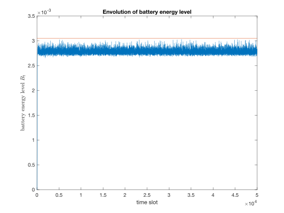
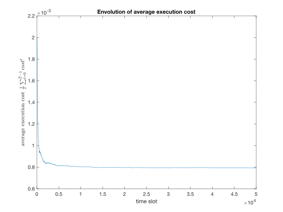
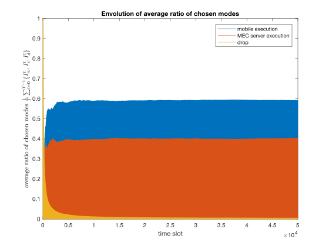
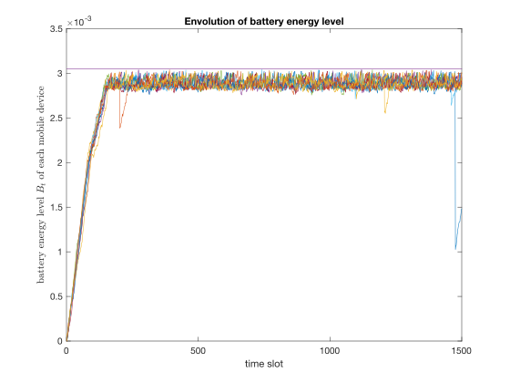
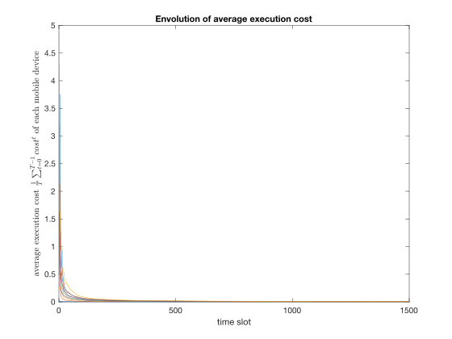
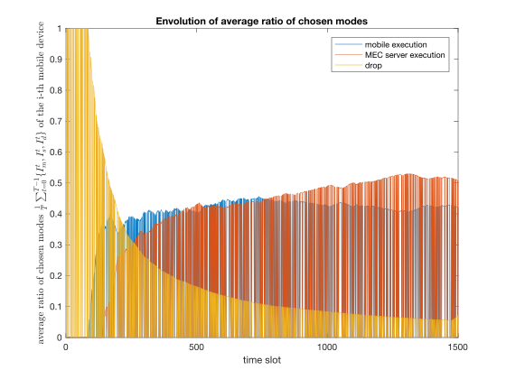

# Edge Computing Codes
Edge computing is the practice of processing data near the edge of the network, where the data is being generated, instead of in a centralised data-processing warehouse.

## UIC18
The folder `UIC18` includes codes for the following paper:

**Hailiang Zhao**, Wei Du, Wei Liu, Tao Lei and Qiwang Lei, *QoE Aware and Cell Capacity Enhanced Computation Offloading for Multi-Server Mobile Edge Computing Systems with Energy Harvesting Devices.* In: **Proceedings of the 15th IEEE International Conference on Ubiquitous Intelligence and Computing (UIC'18)**, Guangzhou, China, 2018.

### LODCO algorithm
This paper is based on the Lyapunov Optimization-based Dynamic Computation Offloading (LODCO) algorithm, which was proposed in the following paper:

Y. Mao, J. Zhang and K. B. Letaief, *Dynamic Computation Offloading for Mobile-Edge Computing With Energy Harvesting Devices*. In: **IEEE Journal on Selected Areas in Communications**, vol. 34, no. 12, pp. 3590-3605, Dec. 2016.

We implemented the LODCO algorithm (`LODCO.m`), and the simulation results are as follows (50000 time slots).

    
    
    

### LODCO-based Greedy algorithm
LODCO-based Greedy algorithm was proposed for computation offloading in *multi-user multi-server* Mobile Edge Computing (MEC) systems. We implemneted the algorithm. The simulation results are as follows (1500 time slots).

    
    
    

## About the Author
**Hailiang Zhao** @ [CCNT Lab](http://www.cs.zju.edu.cn/kejizhan/lab/CCNT.html), [ZJU-CS](http://www.cs.zju.edu.cn/)
* Email: hliangzhao97 {AT} gmail.com
* GitHub: https://github.com/hliangzhao
* Profile: https://hliangzhao.github.io/CV/